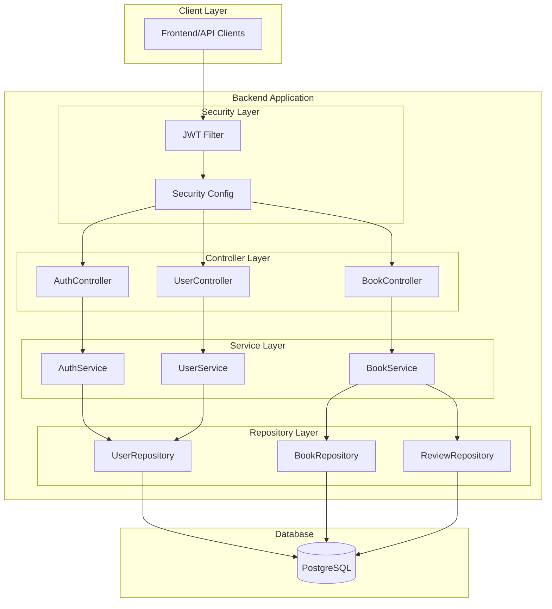
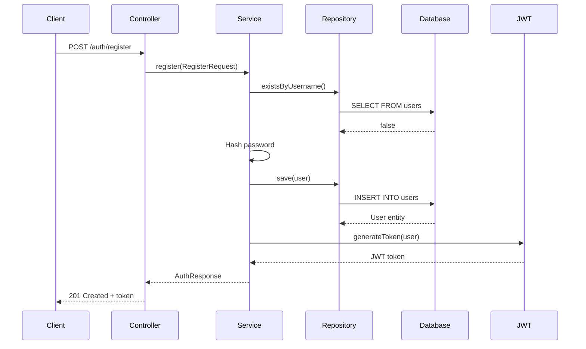
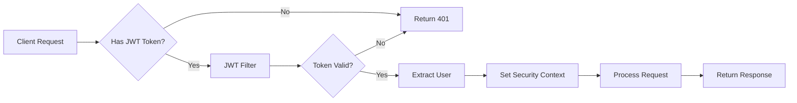
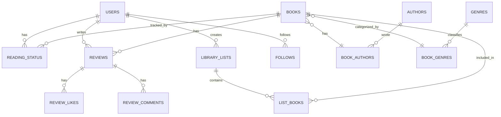

# Backend Architecture Documentation

## System Architecture

The Parche Lector backend implements a clean, layered architecture following Spring Boot best practices. The system is built for scalability, maintainability, and security.

## Architecture Diagram



## Layered Architecture Pattern

### 1. Controller Layer
**Responsibility**: HTTP request handling and response formatting

**Components**:
- `@RestController` annotated classes
- Request mapping and routing
- Request validation
- Response serialization

**Example**:
```java
@RestController
@RequestMapping("/auth")
public class AuthController {
    @PostMapping("/register")
    public ResponseEntity<ApiResponse<AuthResponse>> register(
        @Valid @RequestBody RegisterRequest request
    ) {
        // Delegate to service layer
    }
}
```

---

### 2. Service Layer
**Responsibility**: Business logic and orchestration

**Components**:
- `@Service` annotated classes
- Business rule implementation
- Transaction management
- Service composition

**Pattern**:
```java
public interface AuthService {
    AuthResponse register(RegisterRequest request);
    AuthResponse login(LoginRequest request);
}

@Service
public class AuthServiceImpl implements AuthService {
    // Implementation
}
```

---

### 3. Repository Layer
**Responsibility**: Data access and persistence

**Components**:
- `JpaRepository` interfaces
- Custom query methods
- Database operations

**Pattern**:
```java
public interface UserRepository extends JpaRepository<User, Long> {
    Optional<User> findByUsername(String username);
    Optional<User> findByEmail(String email);
    boolean existsByUsername(String username);
}
```

---

### 4. Entity Layer
**Responsibility**: Domain model representation

**Components**:
- `@Entity` annotated classes
- JPA mappings
- Database table representations

**Example**:
```java
@Entity
@Table(name = "users")
@Data
@NoArgsConstructor
@AllArgsConstructor
public class User {
    @Id
    @GeneratedValue(strategy = GenerationType.IDENTITY)
    private Long id;
    
    private String username;
    private String email;
    private String passwordHash;
}
```

---

## Authentication Flow



## Security Architecture

### JWT Authentication Flow



### Security Components

#### 1. JWT Token Service
**Location**: `security/JwtTokenProvider.java`

**Responsibilities**:
- Generate JWT tokens
- Validate tokens
- Extract user information from tokens
- Handle token expiration

**Key Methods**:
```java
String generateToken(Authentication authentication)
boolean validateToken(String token)
Long getUserIdFromToken(String token)
```

#### 2. JWT Authentication Filter
**Location**: `security/JwtAuthenticationFilter.java`

**Responsibilities**:
- Intercept requests
- Extract JWT from Authorization header
- Validate and parse token
- Set security context

#### 3. Security Configuration
**Location**: `config/SecurityConfig.java`

**Features**:
- Configure HTTP security
- Define public/protected endpoints
- Set up CORS
- Configure authentication filters

**Pattern**:
```java
@Configuration
@EnableWebSecurity
public class SecurityConfig {
    @Bean
    public SecurityFilterChain filterChain(HttpSecurity http) {
        http
            .csrf().disable()
            .authorizeHttpRequests(auth -> auth
                .requestMatchers("/auth/**").permitAll()
                .anyRequest().authenticated()
            )
            .addFilterBefore(jwtFilter, 
                UsernamePasswordAuthenticationFilter.class);
        return http.build();
    }
}
```

---

## Data Transfer Objects (DTOs)

### Request DTOs
**Location**: `dto/request/`

**Purpose**: Validate and structure incoming API requests

**Example**:
```java
@Data
public class RegisterRequest {
    @NotBlank(message = "Username is required")
    @Size(min = 3, max = 32)
    private String username;
    
    @Email(message = "Invalid email format")
    private String email;
    
    @NotBlank
    @Size(min = 6)
    private String password;
}
```

### Response DTOs
**Location**: `dto/response/`

**Purpose**: Structure outgoing API responses

**Example**:
```java
@Data
@AllArgsConstructor
public class AuthResponse {
    private String token;
    private String username;
    private String email;
}
```

### Standard API Response
```java
@Data
@AllArgsConstructor
public class ApiResponse<T> {
    private String status;  // SUCCESS or ERROR
    private String message;
    private T data;
}
```

---

## Database Design

### Entity Relationship Overview



### Core Entities

#### User Entity
```java
@Entity
@Table(name = "users")
public class User {
    @Id @GeneratedValue
    private Long id;
    
    @Column(unique = true, nullable = false)
    private String username;
    
    @Column(unique = true, nullable = false)
    private String email;
    
    private String passwordHash;
    private String avatarUrl;
    private String bio;
    private LocalDateTime createdAt;
    private Boolean isActive;
}
```

#### Book Entity
```java
@Entity
@Table(name = "books")
public class Book {
    @Id @GeneratedValue
    private Long id;
    
    private String title;
    private String description;
    private String isbn10;
    private String isbn13;
    private Integer publishedYear;
    private String coverUrl;
    private Integer pageCount;
    
    @ManyToMany
    private Set<Author> authors;
    
    @ManyToMany
    private Set<Genre> genres;
}
```

#### Review Entity
```java
@Entity
@Table(name = "reviews")
public class Review {
    @Id @GeneratedValue
    private Long id;
    
    @ManyToOne
    private User user;
    
    @ManyToOne
    private Book book;
    
    private BigDecimal rating;
    private String title;
    private String body;
    private LocalDateTime createdAt;
    private Boolean isDeleted;
}
```

---

## Configuration Management

### Application Profiles

#### Development Profile
**File**: `application-dev.properties`

```properties
# Database
spring.datasource.url=jdbc:postgresql://localhost:5432/parche_lector_dev
spring.jpa.show-sql=true
spring.jpa.hibernate.ddl-auto=update

# JWT
jwt.secret=dev-secret-key
jwt.expiration=86400000

# Logging
logging.level.com.parchelector=DEBUG
```

#### Production Profile
**File**: `application-prod.properties`

```properties
# Database (from environment)
spring.datasource.url=${DB_URL}
spring.datasource.username=${DB_USERNAME}
spring.datasource.password=${DB_PASSWORD}

# JWT (from environment)
jwt.secret=${JWT_SECRET}
jwt.expiration=${JWT_EXPIRATION}

# Security
server.ssl.enabled=true
```

---

## Exception Handling

### Global Exception Handler
**Location**: `exception/GlobalExceptionHandler.java`

**Pattern**:
```java
@RestControllerAdvice
public class GlobalExceptionHandler {
    
    @ExceptionHandler(IllegalArgumentException.class)
    public ResponseEntity<ApiResponse<?>> handleIllegalArgument(
        IllegalArgumentException ex
    ) {
        ApiResponse<?> response = new ApiResponse<>(
            "ERROR",
            ex.getMessage(),
            null
        );
        return ResponseEntity
            .status(HttpStatus.BAD_REQUEST)
            .body(response);
    }
    
    @ExceptionHandler(Exception.class)
    public ResponseEntity<ApiResponse<?>> handleGenericException(
        Exception ex
    ) {
        // Log error
        ApiResponse<?> response = new ApiResponse<>(
            "ERROR",
            "Internal server error",
            null
        );
        return ResponseEntity
            .status(HttpStatus.INTERNAL_SERVER_ERROR)
            .body(response);
    }
}
```

### Custom Exceptions
- `UserNotFoundException`
- `DuplicateUsernameException`
- `InvalidCredentialsException`
- `BookNotFoundException`
- `UnauthorizedException`

---

## API Versioning Strategy

### Current Approach
Base URL without version prefix:
```
http://localhost:8080/auth/register
```

### Future Versioning
If versioning is needed:
```
http://localhost:8080/v1/auth/register
http://localhost:8080/v2/auth/register
```

Or header-based versioning:
```
Accept: application/vnd.parchelector.v1+json
```

---

## Performance Optimization

### Database Indexes
Strategic indexes on frequently queried columns:
```sql
CREATE INDEX users_username_idx ON users(username);
CREATE INDEX users_email_idx ON users(email);
CREATE INDEX books_title_idx ON books(title);
CREATE INDEX reviews_book_rating_idx ON reviews(book_id, rating);
```

### JPA Optimization
- Lazy loading for associations
- Fetch joins for N+1 query prevention
- Pagination for large result sets
- Query result caching

### Example Pagination:
```java
@GetMapping("/books")
public Page<Book> getBooks(
    @RequestParam(defaultValue = "0") int page,
    @RequestParam(defaultValue = "20") int size
) {
    Pageable pageable = PageRequest.of(page, size);
    return bookRepository.findAll(pageable);
}
```

---

## Deployment Architecture

### Docker Container

**Dockerfile**:
```dockerfile
FROM openjdk:17-jdk-slim
WORKDIR /app
COPY target/*.jar app.jar
EXPOSE 8080
ENTRYPOINT ["java", "-jar", "app.jar"]
```

### Deployment Options
1. **Docker Compose** - Multi-container setup
2. **Kubernetes** - Container orchestration
3. **Cloud Platform** - Heroku, AWS, Azure, GCP

---

## Monitoring & Logging

### Logging Strategy
```java
@Slf4j
@Service
public class AuthServiceImpl implements AuthService {
    public AuthResponse register(RegisterRequest request) {
        log.info("Registering new user: {}", request.getUsername());
        try {
            // Implementation
            log.info("User registered successfully: {}", username);
        } catch (Exception e) {
            log.error("Registration failed for: {}", 
                request.getUsername(), e);
            throw e;
        }
    }
}
```

### Logging Levels
- **ERROR** - Critical issues requiring immediate attention
- **WARN** - Potential problems
- **INFO** - General application flow
- **DEBUG** - Detailed diagnostic information

---

## Testing Strategy

### Unit Tests
Test individual components in isolation:
```java
@Test
void testUserRegistration() {
    RegisterRequest request = new RegisterRequest(
        "testuser", "test@email.com", "password123"
    );
    
    when(userRepository.existsByUsername("testuser"))
        .thenReturn(false);
    
    AuthResponse response = authService.register(request);
    
    assertNotNull(response.getToken());
}
```

### Integration Tests
Test complete workflows:
```java
@SpringBootTest
@AutoConfigureMockMvc
class AuthControllerTest {
    @Test
    void testRegisterEndpoint() throws Exception {
        mockMvc
            .perform(post("/auth/register")
                .contentType(MediaType.APPLICATION_JSON)
                .content(registerJson))
            .andExpect(status().isCreated())
            .andExpect(jsonPath("$.status").value("SUCCESS"));
    }
}
```

---

## Future Enhancements

### Planned Features
1. **Caching Layer** - Redis for performance
2. **Event-Driven Architecture** - Kafka for async processing
3. **Microservices** - Service decomposition
4. **GraphQL API** - Flexible data querying
5. **Real-time Features** - WebSocket integration

---

**Architecture Version**: 1.0  
**Last Updated**: 2025-11-21
