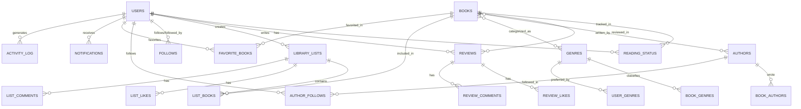

# Database Schema Documentation

## Overview

The Parche Lector database uses PostgreSQL with a comprehensive relational schema designed to support a feature-rich book community platform. The schema consists of 19+ tables organized into functional groups.

## Database Technology

- **RDBMS**: PostgreSQL 14+
- **ORM**: Spring Data JPA / Hibernate
- **Migration Tool**: SQL Scripts
- **Schema File**: `ESQUEMA_PARCHE_LECTOR_POSTGRES.sql`

---

## Schema Visualization

### Entity Relationship Diagram



---

## Core Tables

### 1. users

**Purpose**: Store user account information

| Column | Type | Constraints | Description |
|--------|------|-------------|-------------|
| id | SERIAL | PRIMARY KEY | Unique user identifier |
| username | VARCHAR(32) | UNIQUE, NOT NULL | Unique username |
| email | VARCHAR(255) | UNIQUE, NOT NULL | User email address |
| password_hash | VARCHAR(255) | NOT NULL | BCrypt hashed password |
| avatar_url | VARCHAR(512) | | Profile picture URL |
| bio | TEXT | | User biography |
| created_at | TIMESTAMP | NOT NULL, DEFAULT NOW() | Account creation date |
| is_active | BOOLEAN | NOT NULL, DEFAULT true | Account status |

**Indexes**:
- `users_username_idx` on `username`
- `users_email_idx` on `email`
- `users_created_at_idx` on `created_at`

**SQL**:
```sql
CREATE TABLE users (
  id SERIAL PRIMARY KEY,
  username VARCHAR(32) UNIQUE NOT NULL,
  email VARCHAR(255) UNIQUE NOT NULL,
  password_hash VARCHAR(255) NOT NULL,
  avatar_url VARCHAR(512),
  bio TEXT,
  created_at TIMESTAMP NOT NULL DEFAULT CURRENT_TIMESTAMP,
  is_active BOOLEAN NOT NULL DEFAULT true
);
```

---

### 2. books

**Purpose**: Store book catalog information

| Column | Type | Constraints | Description |
|--------|------|-------------|-------------|
| id | SERIAL | PRIMARY KEY | Unique book identifier |
| title | VARCHAR(255) | NOT NULL | Book title |
| description | TEXT | | Book description/synopsis |
| isbn10 | VARCHAR(10) | | ISBN-10 identifier |
| isbn13 | VARCHAR(13) | UNIQUE | ISBN-13 identifier |
| published_year | INTEGER | | Year of publication |
| cover_url | VARCHAR(512) | | Cover image URL |
| language | VARCHAR(10) | | Language code (e.g., 'en', 'es') |
| page_count | INTEGER | | Number of pages |
| created_at | TIMESTAMP | NOT NULL, DEFAULT NOW() | Record creation |
| updated_at | TIMESTAMP | NOT NULL, DEFAULT NOW() | Last update |

**Indexes**:
- `books_title_idx` on `title`
- `books_isbn13_idx` on `isbn13` (UNIQUE)
- `books_published_year_idx` on `published_year`
- `books_created_at_idx` on `created_at`

**SQL**:
```sql
CREATE TABLE books (
  id SERIAL PRIMARY KEY,
  title VARCHAR(255) NOT NULL,
  description TEXT,
  isbn10 VARCHAR(10),
  isbn13 VARCHAR(13),
  published_year INTEGER,
  cover_url VARCHAR(512),
  language VARCHAR(10),
  page_count INTEGER,
  created_at TIMESTAMP NOT NULL DEFAULT CURRENT_TIMESTAMP,
  updated_at TIMESTAMP NOT NULL DEFAULT CURRENT_TIMESTAMP
);
```

---

### 3. authors

**Purpose**: Store author information

| Column | Type | Constraints | Description |
|--------|------|-------------|-------------|
| id | SERIAL | PRIMARY KEY | Unique author identifier |
| name | VARCHAR(255) | NOT NULL | Author full name |
| sort_name | VARCHAR(255) | | Name for sorting (Last, First) |
| created_at | TIMESTAMP | NOT NULL, DEFAULT NOW() | Record creation |
| updated_at | TIMESTAMP | NOT NULL, DEFAULT NOW() | Last update |

**Indexes**:
- `authors_name_idx` on `name`

---

### 4. genres

**Purpose**: Store book genre/category information

| Column | Type | Constraints | Description |
|--------|------|-------------|-------------|
| id | SERIAL | PRIMARY KEY | Unique genre identifier |
| name | VARCHAR(64) | UNIQUE, NOT NULL | Genre name |

---

## Relationship Tables

### 5. book_authors

**Purpose**: Many-to-many relationship between books and authors

| Column | Type | Constraints | Description |
|--------|------|-------------|-------------|
| book_id | INTEGER | PK, FK → books.id | Book reference |
| author_id | INTEGER | PK, FK → authors.id | Author reference |
| role | VARCHAR(64) | | Author role (author, editor, translator) |
| position | INTEGER | | Author order for display |

**Primary Key**: `(book_id, author_id)`

**Indexes**:
- `book_authors_author_id_idx` on `author_id`

---

### 6. book_genres

**Purpose**: Many-to-many relationship between books and genres

| Column | Type | Constraints | Description |
|--------|------|-------------|-------------|
| book_id | INTEGER | PK, FK → books.id | Book reference |
| genre_id | INTEGER | PK, FK → genres.id | Genre reference |

**Primary Key**: `(book_id, genre_id)`

**Indexes**:
- `book_genres_genre_id_idx` on `genre_id`

---

## Reading & Status Tables

### 7. reading_status

**Purpose**: Track user reading progress for books

| Column | Type | Constraints | Description |
|--------|------|-------------|-------------|
| id | SERIAL | PRIMARY KEY | Unique status identifier |
| user_id | INTEGER | FK → users.id, NOT NULL | User reference |
| book_id | INTEGER | FK → books.id, NOT NULL | Book reference |
| status | ENUM | NOT NULL | Reading status |
| progress_percent | INTEGER | DEFAULT 0 | Reading progress (0-100) |
| started_at | DATE | | Date started reading |
| finished_at | DATE | | Date finished reading |
| created_at | TIMESTAMP | NOT NULL, DEFAULT NOW() | Record creation |
| updated_at | TIMESTAMP | NOT NULL, DEFAULT NOW() | Last update |

**Enum Type**: `reading_status_enum`
- Values: `WANT_TO_READ`, `READING`, `READ`

**Indexes**:
- `reading_status_user_book_idx` (UNIQUE) on `(user_id, book_id)`
- `reading_status_status_idx` on `status`

**SQL**:
```sql
CREATE TYPE reading_status_enum AS ENUM (
  'WANT_TO_READ', 
  'READING', 
  'READ'
);

CREATE TABLE reading_status (
  id SERIAL PRIMARY KEY,
  user_id INTEGER NOT NULL,
  book_id INTEGER NOT NULL,
  status reading_status_enum NOT NULL,
  progress_percent INTEGER DEFAULT 0,
  started_at DATE,
  finished_at DATE,
  created_at TIMESTAMP NOT NULL DEFAULT CURRENT_TIMESTAMP,
  updated_at TIMESTAMP NOT NULL DEFAULT CURRENT_TIMESTAMP
);
```

---

### 8. reading_events

**Purpose**: Log detailed reading events for analytics

| Column | Type | Constraints | Description |
|--------|------|-------------|-------------|
| id | SERIAL | PRIMARY KEY | Unique event identifier |
| user_id | INTEGER | FK → users.id, NOT NULL | User reference |
| book_id | INTEGER | FK → books.id, NOT NULL | Book reference |
| event_type | VARCHAR(24) | NOT NULL | Event type |
| value | INTEGER | | Event value (pages read, etc.) |
| created_at | TIMESTAMP | NOT NULL, DEFAULT NOW() | Event timestamp |

**Event Types**:
- `STARTED_READING`
- `UPDATED_PROGRESS`
- `FINISHED_READING`
- `ADDED_TO_LIST`

**Indexes**:
- `reading_events_user_created_idx` on `(user_id, created_at)`
- `reading_events_book_created_idx` on `(book_id, created_at)`

---

## Review & Social Tables

### 9. reviews

**Purpose**: Store user book reviews and ratings

| Column | Type | Constraints | Description |
|--------|------|-------------|-------------|
| id | SERIAL | PRIMARY KEY | Unique review identifier |
| user_id | INTEGER | FK → users.id, NOT NULL | Reviewer reference |
| book_id | INTEGER | FK → books.id, NOT NULL | Book reference |
| rating | DECIMAL(2,1) | NOT NULL | Rating (0.0 - 5.0) |
| title | VARCHAR(140) | | Review title |
| body | TEXT | | Review content |
| created_at | TIMESTAMP | NOT NULL, DEFAULT NOW() | Creation timestamp |
| updated_at | TIMESTAMP | NOT NULL, DEFAULT NOW() | Last update |
| is_deleted | BOOLEAN | NOT NULL, DEFAULT false | Soft delete flag |

**Indexes**:
- `reviews_user_book_idx` (UNIQUE) on `(user_id, book_id)` - One review per user per book
- `reviews_book_rating_idx` on `(book_id, rating)`
- `reviews_created_at_idx` on `created_at`

---

### 10. review_likes

**Purpose**: Track user likes on reviews

| Column | Type | Constraints | Description |
|--------|------|-------------|-------------|
| review_id | INTEGER | PK, FK → reviews.id | Review reference |
| user_id | INTEGER | PK, FK → users.id | User who liked |
| created_at | TIMESTAMP | NOT NULL, DEFAULT NOW() | Like timestamp |

**Primary Key**: `(review_id, user_id)`

---

### 11. review_comments

**Purpose**: Comments on reviews

| Column | Type | Constraints | Description |
|--------|------|-------------|-------------|
| id | SERIAL | PRIMARY KEY | Unique comment identifier |
| review_id | INTEGER | FK → reviews.id, NOT NULL | Review reference |
| user_id | INTEGER | FK → users.id, NOT NULL | Commenter reference |
| body | TEXT | NOT NULL | Comment content |
| created_at | TIMESTAMP | NOT NULL, DEFAULT NOW() | Creation timestamp |
| is_deleted | BOOLEAN | NOT NULL, DEFAULT false | Soft delete flag |

**Indexes**:
- `review_comments_review_created_idx` on `(review_id, created_at)`

---

## List Tables

### 12. library_lists

**Purpose**: User-created book lists

| Column | Type | Constraints | Description |
|--------|------|-------------|-------------|
| id | SERIAL | PRIMARY KEY | Unique list identifier |
| user_id | INTEGER | FK → users.id, NOT NULL | List owner |
| name | VARCHAR(140) | NOT NULL | List name |
| description | TEXT | | List description |
| visibility | ENUM | NOT NULL, DEFAULT 'PUBLIC' | List visibility |
| created_at | TIMESTAMP | NOT NULL, DEFAULT NOW() | Creation timestamp |
| updated_at | TIMESTAMP | NOT NULL, DEFAULT NOW() | Last update |

**Enum Type**: `visibility_enum`
- Values: `PUBLIC`, `PRIVATE`

**Indexes**:
- `library_lists_user_name_idx` on `(user_id, name)`

---

### 13. list_books

**Purpose**: Books within a library list

| Column | Type | Constraints | Description |
|--------|------|-------------|-------------|
| list_id | INTEGER | PK, FK → library_lists.id | List reference |
| book_id | INTEGER | PK, FK → books.id | Book reference |
| position | INTEGER | NOT NULL, DEFAULT 1 | Book order in list |
| note | VARCHAR(255) | | Optional note |
| added_at | TIMESTAMP | NOT NULL, DEFAULT NOW() | Addition timestamp |

**Primary Key**: `(list_id, book_id)`

**Indexes**:
- `list_books_list_position_idx` (UNIQUE) on `(list_id, position)`

---

### 14. list_likes

**Purpose**: User likes on lists

| Column | Type | Constraints | Description |
|--------|------|-------------|-------------|
| list_id | INTEGER | PK, FK → library_lists.id | List reference |
| user_id | INTEGER | PK, FK → users.id | User who liked |
| created_at | TIMESTAMP | NOT NULL, DEFAULT NOW() | Like timestamp |

**Primary Key**: `(list_id, user_id)`

---

### 15. list_comments

**Purpose**: Comments on lists

| Column | Type | Constraints | Description |
|--------|------|-------------|-------------|
| id | SERIAL | PRIMARY KEY | Unique comment identifier |
| list_id | INTEGER | FK → library_lists.id, NOT NULL | List reference |
| user_id | INTEGER | FK → users.id, NOT NULL | Commenter reference |
| body | TEXT | NOT NULL | Comment content |
| created_at | TIMESTAMP | NOT NULL, DEFAULT NOW() | Creation timestamp |
| is_deleted | BOOLEAN | NOT NULL, DEFAULT false | Soft delete flag |

**Indexes**:
- `list_comments_list_created_idx` on `(list_id, created_at)`

---

## Social Tables

### 16. follows

**Purpose**: User follow relationships

| Column | Type | Constraints | Description |
|--------|------|-------------|-------------|
| follower_id | INTEGER | PK, FK → users.id | User who follows |
| followed_id | INTEGER | PK, FK → users.id | User being followed |
| created_at | TIMESTAMP | NOT NULL, DEFAULT NOW() | Follow timestamp |

**Primary Key**: `(follower_id, followed_id)`

**Indexes**:
- `follows_followed_id_idx` on `followed_id`

**Constraint**: `follower_id ≠ followed_id` (users cannot follow themselves)

---

### 17. author_follows

**Purpose**: Users following authors

| Column | Type | Constraints | Description |
|--------|------|-------------|-------------|
| user_id | INTEGER | PK, FK → users.id | User reference |
| author_id | INTEGER | PK, FK → authors.id | Author reference |
| created_at | TIMESTAMP | NOT NULL, DEFAULT NOW() | Follow timestamp |

**Primary Key**: `(user_id, author_id)`

---

### 18. favorite_books

**Purpose**: User favorite books

| Column | Type | Constraints | Description |
|--------|------|-------------|-------------|
| user_id | INTEGER | PK, FK → users.id | User reference |
| book_id | INTEGER | PK, FK → books.id | Book reference |
| created_at | TIMESTAMP | NOT NULL, DEFAULT NOW() | Favorite timestamp |

**Primary Key**: `(user_id, book_id)`

---

### 19. user_genres

**Purpose**: User preferred genres

| Column | Type | Constraints | Description |
|--------|------|-------------|-------------|
| user_id | INTEGER | PK, FK → users.id | User reference |
| genre_id | INTEGER | PK, FK → genres.id | Genre reference |

**Primary Key**: `(user_id, genre_id)`

---

## Activity & Notifications

### 20. activity_log

**Purpose**: Track user activities for feed generation

| Column | Type | Constraints | Description |
|--------|------|-------------|-------------|
| id | SERIAL | PRIMARY KEY | Unique activity identifier |
| user_id | INTEGER | FK → users.id, NOT NULL | User who performed action |
| type | VARCHAR(32) | NOT NULL | Activity type |
| subject_book_id | INTEGER | FK → books.id | Related book (optional) |
| subject_review_id | INTEGER | FK → reviews.id | Related review (optional) |
| subject_list_id | INTEGER | FK → library_lists.id | Related list (optional) |
| created_at | TIMESTAMP | NOT NULL, DEFAULT NOW() | Activity timestamp |

**Activity Types**:
- `STARTED_BOOK`
- `FINISHED_BOOK`
- `POSTED_REVIEW`
- `CREATED_LIST`
- `FOLLOWED_USER`

**Indexes**:
- `activity_log_user_created_idx` on `(user_id, created_at)`
- `activity_log_type_idx` on `type`

---

### 21. notifications

**Purpose**: User notifications

| Column | Type | Constraints | Description |
|--------|------|-------------|-------------|
| id | SERIAL | PRIMARY KEY | Unique notification identifier |
| user_id | INTEGER | FK → users.id, NOT NULL | Recipient user |
| type | VARCHAR(32) | NOT NULL | Notification type |
| payload | JSONB | | Notification data |
| is_read | BOOLEAN | NOT NULL, DEFAULT false | Read status |
| created_at | TIMESTAMP | NOT NULL, DEFAULT NOW() | Creation timestamp |

**Notification Types**:
- `NEW_FOLLOWER`
- `REVIEW_LIKED`
- `REVIEW_COMMENTED`
- `LIST_LIKED`

**Indexes**:
- `notifications_user_read_idx` on `(user_id, is_read)`
- `notifications_created_at_idx` on `created_at`

---

## Security & Moderation Tables

### 22. password_reset_tokens

**Purpose**: Manage password reset requests

| Column | Type | Constraints | Description |
|--------|------|-------------|-------------|
| id | SERIAL | PRIMARY KEY | Unique token identifier |
| user_id | INTEGER | FK → users.id, NOT NULL | User reference |
| token_hash | VARCHAR(255) | UNIQUE, NOT NULL | Hashed reset token |
| created_at | TIMESTAMP | NOT NULL, DEFAULT NOW() | Token generation time |
| expires_at | TIMESTAMP | NOT NULL | Token expiration |
| used_at | TIMESTAMP | | Token usage timestamp |

---

### 23. email_verification_tokens

**Purpose**: Email verification for new accounts

| Column | Type | Constraints | Description |
|--------|------|-------------|-------------|
| id | SERIAL | PRIMARY KEY | Unique token identifier |
| user_id | INTEGER | FK → users.id, NOT NULL | User reference |
| token_hash | VARCHAR(255) | UNIQUE, NOT NULL | Hashed verification token |
| created_at | TIMESTAMP | NOT NULL, DEFAULT NOW() | Token generation time |
| expires_at | TIMESTAMP | NOT NULL | Token expiration |
| used_at | TIMESTAMP | | Token usage timestamp |

---

### 24. reports

**Purpose**: User-submitted content reports

| Column | Type | Constraints | Description |
|--------|------|-------------|-------------|
| id | SERIAL | PRIMARY KEY | Unique report identifier |
| reporter_id | INTEGER | FK → users.id, NOT NULL | User who reported |
| target_type | VARCHAR(32) | NOT NULL | Type of reported content |
| target_id | INTEGER | NOT NULL | ID of reported content |
| reason | VARCHAR(140) | NOT NULL | Report reason |
| details | TEXT | | Detailed description |
| status | VARCHAR(16) | NOT NULL, DEFAULT 'OPEN' | Report status |
| created_at | TIMESTAMP | NOT NULL, DEFAULT NOW() | Report timestamp |
| resolved_by | INTEGER | FK → users.id | Admin who resolved |
| resolved_at | TIMESTAMP | | Resolution timestamp |

**Target Types**:
- `REVIEW`
- `COMMENT`
- `LIST`
- `USER`

**Report Statuses**:
- `OPEN`
- `UNDER_REVIEW`
- `RESOLVED`
- `DISMISSED`

---

## Database Constraints

### Foreign Key Constraints

All relationship tables have `ON DELETE CASCADE` constraints to maintain referential integrity:

```sql
-- Example constraints
ALTER TABLE reading_status 
  ADD FOREIGN KEY (user_id) REFERENCES users(id) ON DELETE CASCADE;

ALTER TABLE reading_status 
  ADD FOREIGN KEY (book_id) REFERENCES books(id) ON DELETE CASCADE;
```

### Unique Constraints

Strategic unique constraints prevent duplicate data:

- `users.username` - Unique usernames
- `users.email` - Unique emails
- `books.isbn13` - Unique ISBN-13
- `genres.name` - Unique genre names
- `(user_id, book_id)` - One review per user per book
- `(list_id, position)` - Unique positions in lists

---

## Indexing Strategy

### Performance Indexes

Indexes are created for:
1. **Foreign Keys** - Improve join performance
2. **Search Columns** - Username, email, title searches
3. **Filter Columns** - Status, dates, ratings
4. **Sort Columns** - Created dates, positions

### Example Queries Optimized

```sql
-- Fast user lookup by username
SELECT * FROM users WHERE username = 'john_doe';
-- Uses: users_username_idx

-- Get user's reading list
SELECT * FROM reading_status 
WHERE user_id = 123 AND status = 'READING';
-- Uses: reading_status_user_book_idx

-- Recent reviews for a book
SELECT * FROM reviews 
WHERE book_id = 456 
ORDER BY created_at DESC;
-- Uses: reviews_book_rating_idx, reviews_created_at_idx
```

---

## Data Integrity

### Soft Deletes

Certain tables use soft deletes (`is_deleted` flag) instead of hard deletes:
- `reviews`
- `review_comments`
- `list_comments`

This preserves data integrity and allows for content recovery.

### Timestamps

All tables include:
- `created_at` - Record creation
- `updated_at` - Last modification (where applicable)

Timestamps use `DEFAULT CURRENT_TIMESTAMP` for automatic population.

---

## Scaling Considerations

### Partitioning Opportunities

For large datasets, consider partitioning:
- `activity_log` by date range
- `notifications` by date range
- `reading_events` by date range

### Archiving Strategy

Old data archiving for:
- Resolved reports (after 1 year)
- Read notifications (after 6 months)
- Expired tokens (immediately after expiration)

---

**Schema Version**: 1.0  
**Last Updated**: 2025-11-21  
**Total Tables**: 24  
**Total Indexes**: 30+
