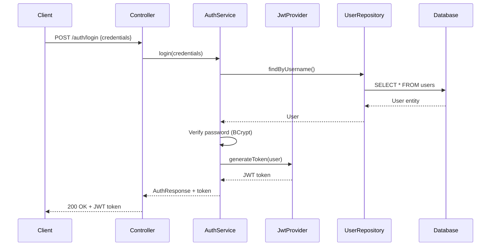

# Security Documentation

## Security Overview

The Parche Lector backend implements enterprise-grade security using Spring Security and JWT (JSON Web Tokens) for authentication and authorization.

---

## Authentication Architecture

### JWT-Based Authentication

The application uses **stateless** authentication via JSON Web Tokens (JWT):

1. User registers or logs in with credentials
2. Server validates credentials
3. Server generates JWT token
4. Client stores token
5. Client includes token in subsequent requests
6. Server validates token for each request



---

## Password Security

### Hashing Algorithm

**BCrypt** is used for password hashing:

```java
@Configuration
public class SecurityConfig {
    @Bean
    public PasswordEncoder passwordEncoder() {
        return new BCryptPasswordEncoder();
    }
}
```

### Why BCrypt?

- **Adaptive hashing**: Automatically adjusts to hardware improvements
- **Salted**: Each password gets a unique salt
- **Configurable cost**: Can increase difficulty as needed
- **Industry standard**: Widely trusted and tested

### Password Requirements

**Current Requirements**:
- Minimum 6 characters

**Recommended Requirements** (future):
- Minimum 8 characters
- At least one uppercase letter
- At least one number
- At least one special character

### Password Storage

Passwords are **never stored in plain text**:

```java
// Registration process
String rawPassword = registerRequest.getPassword();
String hashedPassword = passwordEncoder.encode(rawPassword);

User user = new User();
user.setPasswordHash(hashedPassword);
userRepository.save(user);
```

### Password Verification

```java
// Login process
boolean matches = passwordEncoder.matches(
    rawPassword, 
    user.getPasswordHash()
);

if (!matches) {
    throw new InvalidCredentialsException();
}
```

---

## JWT Token Management

### Token Structure

A JWT consists of three parts:

```
eyJhbGciOiJIUzI1NiIsInR5cCI6IkpXVCJ9.
eyJzdWIiOiIxMjM0NTY3ODkwIiwibmFtZSI6IkpvaG4gRG9lIiwiaWF0IjoxNTE2MjM5MDIyfQ.
SflKxwRJSMeKKF2QT4fwpMeJf36POk6yJV_adQssw5c
```

**Parts**:
1. **Header** - Algorithm and token type
2. **Payload** - Claims (user data)
3. **Signature** - Verification signature

### Token Generation

**Location**: `security/JwtTokenProvider.java`

```java
public String generateToken(Authentication authentication) {
    UserPrincipal userPrincipal = (UserPrincipal) authentication.getPrincipal();
    
    Date now = new Date();
    Date expiryDate = new Date(now.getTime() + jwtExpirationMs);
    
    return Jwts.builder()
        .setSubject(Long.toString(userPrincipal.getId()))
        .setIssuedAt(now)
        .setExpiration(expiryDate)
        .signWith(SignatureAlgorithm.HS512, jwtSecret)
        .compact();
}
```

### Token Claims

**Standard Claims**:
- `sub` (subject): User ID
- `iat` (issued at): Token creation time
- `exp` (expiration): Token expiration time

**Custom Claims** (optional):
- `username`: User's username
- `email`: User's email
- `roles`: User roles (future feature)

### Token Validation

```java
public boolean validateToken(String authToken) {
    try {
        Jwts.parser()
            .setSigningKey(jwtSecret)
            .parseClaimsJws(authToken);
        return true;
    } catch (SignatureException ex) {
        logger.error("Invalid JWT signature");
    } catch (MalformedJwtException ex) {
        logger.error("Invalid JWT token");
    } catch (ExpiredJwtException ex) {
        logger.error("Expired JWT token");
    } catch (UnsupportedJwtException ex) {
        logger.error("Unsupported JWT token");
    } catch (IllegalArgumentException ex) {
        logger.error("JWT claims string is empty");
    }
    return false;
}
```

### Token Expiration

**Default Configuration**:
```properties
jwt.expiration=86400000
# 86400000ms = 24 hours
```

**Expiration Timeline**:
```
Token Created → 24 hours → Token Expires
```

When a token expires:
1. API returns `401 Unauthorized`
2. Client must login again
3. New token is issued

---

## Authentication Filter

### JWT Authentication Filter

**Location**: `security/JwtAuthenticationFilter.java`

**Responsibilities**:
1. Extract JWT from Authorization header
2. Validate token
3. Load user details
4. Set authentication in Security Context

```java
@Component
public class JwtAuthenticationFilter extends OncePerRequestFilter {
    
    @Override
    protected void doFilterInternal(
        HttpServletRequest request,
        HttpServletResponse response,
        FilterChain filterChain
    ) throws ServletException, IOException {
        
        try {
            String jwt = getJwtFromRequest(request);
            
            if (StringUtils.hasText(jwt) && tokenProvider.validateToken(jwt)) {
                Long userId = tokenProvider.getUserIdFromToken(jwt);
                
                UserDetails userDetails = customUserDetailsService
                    .loadUserById(userId);
                    
                UsernamePasswordAuthenticationToken authentication = 
                    new UsernamePasswordAuthenticationToken(
                        userDetails, null, userDetails.getAuthorities()
                    );
                    
                SecurityContextHolder.getContext()
                    .setAuthentication(authentication);
            }
        } catch (Exception ex) {
            logger.error("Could not set user authentication", ex);
        }
        
        filterChain.doFilter(request, response);
    }
    
    private String getJwtFromRequest(HttpServletRequest request) {
        String bearerToken = request.getHeader("Authorization");
        if (StringUtils.hasText(bearerToken) 
            && bearerToken.startsWith("Bearer ")) {
            return bearerToken.substring(7);
        }
        return null;
    }
}
```

### Filter Chain

```
Request → CORS Filter → JWT Filter → Authorization → Controller
```

---

## Security Configuration

### Spring Security Config

**Location**: `config/SecurityConfig.java`

```java
@Configuration
@EnableWebSecurity
public class SecurityConfig {
    
    @Autowired
    private JwtAuthenticationFilter jwtAuthenticationFilter;
    
    @Bean
    public SecurityFilterChain filterChain(HttpSecurity http) 
        throws Exception {
        
        http
            .cors()
            .and()
            .csrf().disable()
            .sessionManagement()
                .sessionCreationPolicy(SessionCreationPolicy.STATELESS)
            .and()
            .authorizeHttpRequests(auth -> auth
                .requestMatchers("/auth/**").permitAll()
                .requestMatchers("/swagger-ui/**").permitAll()
                .requestMatchers("/api-docs/**").permitAll()
                .anyRequest().authenticated()
            )
            .addFilterBefore(
                jwtAuthenticationFilter,
                UsernamePasswordAuthenticationFilter.class
            );
        
        return http.build();
    }
    
    @Bean
    public AuthenticationManager authenticationManager(
        AuthenticationConfiguration config
    ) throws Exception {
        return config.getAuthenticationManager();
    }
}
```

### Public Endpoints

These endpoints don't require authentication:

- `/auth/register` - User registration
- `/auth/login` - User login
- `/swagger-ui.html` - API documentation
- `/api-docs` - OpenAPI specification

### Protected Endpoints

All other endpoints require a valid JWT token:

```
GET /users/{id}
GET /books
POST /reviews
... (all other endpoints)
```

---

## CORS Configuration

### CORS Settings

**Location**: `config/SecurityConfig.java` or `config/CorsConfig.java`

```java
@Bean
public CorsConfigurationSource corsConfigurationSource() {
    CorsConfiguration configuration = new CorsConfiguration();
    
    configuration.setAllowedOrigins(Arrays.asList(
        "http://localhost:5173",  // Vite dev server
        "http://localhost:3000"   // Alternative frontend
    ));
    
    configuration.setAllowedMethods(Arrays.asList(
        "GET", "POST", "PUT", "DELETE", "PATCH", "OPTIONS"
    ));
    
    configuration.setAllowedHeaders(Arrays.asList(
        "Authorization", "Content-Type"
    ));
    
    configuration.setExposedHeaders(Arrays.asList(
        "Authorization"
    ));
    
    configuration.setAllowCredentials(true);
    configuration.setMaxAge(3600L);
    
    UrlBasedCorsConfigurationSource source = 
        new UrlBasedCorsConfigurationSource();
    source.registerCorsConfiguration("/**", configuration);
    
    return source;
}
```

---

## Security Best Practices

### 1. Secret Key Management

**DON'T**: Hard-code secrets in code
```java
// ❌ BAD
private String jwtSecret = "my-secret-key";
```

**DO**: Use environment variables
```java
// ✅ GOOD
@Value("${jwt.secret}")
private String jwtSecret;
```

production configuration:
```bash
export JWT_SECRET=$(openssl rand -base64 64)
```

### 2. Token Storage (Client-Side)

**Options**:

**LocalStorage**:
- ✅ Survives page refreshes
- ❌ Vulnerable to XSS attacks
- Use only for non-sensitive apps

**HttpOnly Cookies** (Recommended):
- ✅ Not accessible by JavaScript
- ✅ Automatic inclusion in requests
- ✅ Protection against XSS
- ❌ Requires CSRF protection

**SessionStorage**:
- ✅ Cleared on tab close
- ❌ Lost on page refresh
- ❌ Vulnerable to XSS

**Memory (Redux/Vuex)**:
- ✅ Most secure
- ❌ Lost on page refresh
- Use with refresh tokens

### 3. HTTPS in Production

Always use HTTPS in production:

```properties
# application-prod.properties
server.ssl.enabled=true
server.ssl.key-store=classpath:keystore.p12
server.ssl.key-store-password=${SSL_PASSWORD}
server.ssl.key-store-type=PKCS12
```

### 4. Rate Limiting

Implement rate limiting to prevent brute force attacks:

```java
// Future implementation
@RateLimit(limit = 5, duration = 60) // 5 attempts/minute
@PostMapping("/auth/login")
public ResponseEntity<?> login(...) {
    // ...
}
```

---

## SQL Injection Prevention

### JPA Protection

JPA (Hibernate) automatically prevents SQL injection:

```java
// ✅ SAFE - Parameterized query
userRepository.findByUsername(username);

// Generated SQL uses parameters:
// SELECT * FROM users WHERE username = ?
```

### Named Queries

```java
@Query("SELECT u FROM User u WHERE u.email = :email")
Optional<User> findByEmail(@Param("email") String email);
```

### Native Queries

Even native queries with `@Query` use parameterization:

```java
@Query(value = "SELECT * FROM users WHERE username = :username", 
       nativeQuery = true)
User findByUsernameNative(@Param("username") String username);
```

---

## XSS Protection

### Input Validation

Validate all inputs:

```java
@Data
public class RegisterRequest {
    @NotBlank
    @Pattern(regexp = "^[a-zA-Z0-9._]+$")
    @Size(min = 3, max = 32)
    private String username;
    
    @Email
    private String email;
}
```

### Output Encoding

Spring Boot automatically escapes output in JSON responses.

### Content Security Policy

Add CSP headers:

```java
@Override
protected void configure(HttpSecurity http) {
    http.headers()
        .contentSecurityPolicy(
            "default-src 'self'; " +
            "script-src 'self' 'unsafe-inline'; " +
            "style-src 'self' 'unsafe-inline'"
        );
}
```

---

## CSRF Protection

### Why Disabled for JWT

CSRF protection is disabled because:

1. JWT is stored client-side (not in cookies)
2. Stateless authentication
3. Must be explicitly sent in headers

If using cookies for tokens, CSRF protection is **required**:

```java
http.csrf().csrfTokenRepository(
    CookieCsrfTokenRepository.withHttpOnlyFalse()
);
```

---

## Authorization (Future Feature)

### Role-Based Access Control

Planned roles:

- `USER` - Regular user
- `MODERATOR` - Content moderator
- `ADMIN` - Full access

```java
// Future implementation
@PreAuthorize("hasRole('ADMIN')")
@DeleteMapping("/users/{id}")
public ResponseEntity<?> deleteUser(@PathVariable Long id) {
    // Only admins can delete users
}
```

### Permission-Based Access

```java
@PreAuthorize("hasPermission(#review, 'EDIT')")
@PutMapping("/reviews/{id}")
public ResponseEntity<?> updateReview(
    @PathVariable Long id,
    @RequestBody UpdateReviewRequest request
) {
    // Only review owner can edit
}
```

---

## Security Headers

### Recommended Headers

```java
http.headers()
    .contentTypeOptions()
    .and()
    .xssProtection()
    .and()
    .cacheControl()
    .and()
    .httpStrictTransportSecurity()
    .and()
    .frameOptions().deny();
```

**Headers Applied**:
- `X-Content-Type-Options: nosniff`
- `X-XSS-Protection: 1; mode=block`
- `Cache-Control: no-cache, no-store, must-revalidate`
- `Strict-Transport-Security: max-age=31536000`
- `X-Frame-Options: DENY`

---

## Auditing

### Track Security Events

```java
@Entity
@Table(name = "security_audit_log")
public class SecurityAuditLog {
    private Long id;
    private String username;
    private String action;  // LOGIN, LOGOUT, FAILED_LOGIN
    private String ipAddress;
    private LocalDateTime timestamp;
}
```

### Log Security Events

```java
@Service
public class SecurityAuditService {
    public void logLoginAttempt(
        String username, 
        boolean success,
        String ipAddress
    ) {
        SecurityAuditLog log = new SecurityAuditLog();
        log.setUsername(username);
        log.setAction(success ? "LOGIN" : "FAILED_LOGIN");
        log.setIpAddress(ipAddress);
        log.setTimestamp(LocalDateTime.now());
        
        auditRepository.save(log);
    }
}
```

---

## Security Checklist

### Development

- [ ] Use HTTPS in production
- [ ] Store secrets in environment variables
- [ ] Implement input validation
- [ ] Use parameterized queries
- [ ] Enable security headers
- [ ] Implement rate limiting
- [ ] Add audit logging
- [ ] Use strong passwords requirements

### Production

- [ ] Change default JWT secret
- [ ] Enable SSL/TLS
- [ ] Use secure cookies
- [ ] Implement CSRF protection (if using cookies)
- [ ] Set up monitoring and alerts
- [ ] Regular security audits
- [ ] Keep dependencies updated
- [ ] Backup encryption keys

---

## Security Testing

### Test Authentication

```java
@Test
void testLoginWithInvalidCredentials() {
    LoginRequest request = new LoginRequest(
        "user", "wrongpassword"
    );
    
    assertThrows(InvalidCredentialsException.class, () -> {
        authService.login(request);
    });
}
```

### Test Authorization

```java
@Test
void testAccessProtectedEndpointWithoutToken() {
    mockMvc.perform(get("/users/1"))
        .andExpect(status().isUnauthorized());
}
```

### Penetration Testing

Consider tools:
- **OWASP ZAP** - Security scanner
- **Burp Suite** - Web vulnerability scanner
- **SonarQube** - Code security analysis

---

**Security Documentation Version**: 1.0  
**Last Updated**: 2025-11-21
