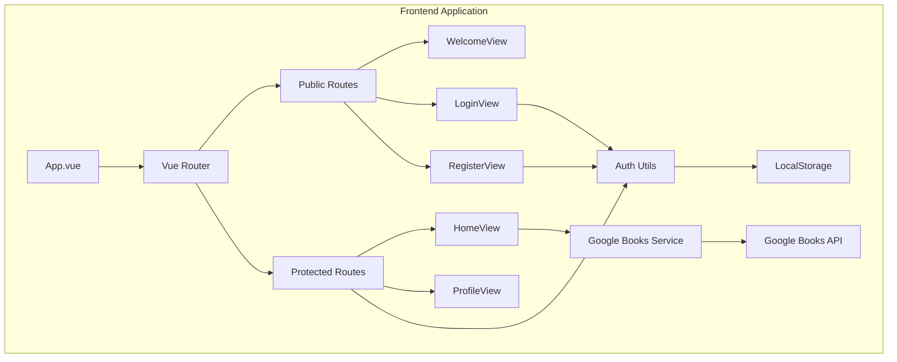
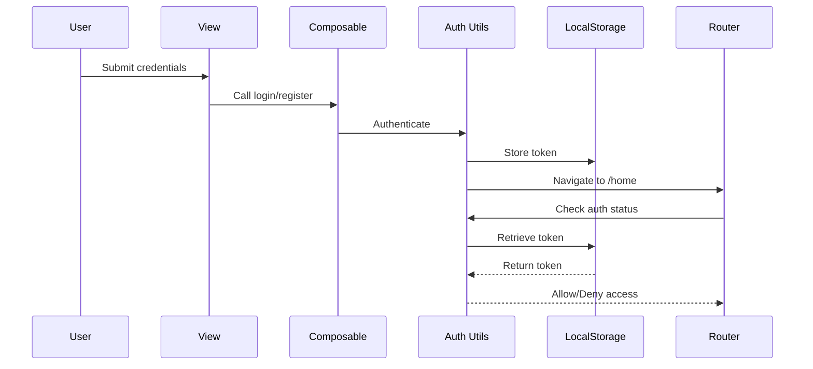

# Frontend Architecture Documentation

## System Architecture

The Parche Lector frontend follows a modular, component-based architecture built on Vue 3 with TypeScript. The application uses a feature-based organization pattern for better maintainability and scalability.

## Architecture Diagram



## Core Architecture Patterns

### 1. Composition API Pattern

The application uses Vue 3's Composition API for better code organization and reusability.

**Example Structure**:
```typescript
<script setup lang="ts">
import { ref, computed, onMounted } from 'vue'

// Reactive state
const books = ref<Book[]>([])

// Computed properties
const filteredBooks = computed(() => {
  return books.value.filter(/* ... */)
})

// Lifecycle hooks
onMounted(() => {
  loadBooks()
})
</script>
```

### 2. Feature Module Pattern

Related functionality is organized into feature modules (e.g., `login/`, `register/`) containing:
- **views/**: Feature-specific views
- **composables/**: Reusable composition functions

**Benefits**:
- Clear separation of concerns
- Easy to locate related code
- Better code organization

### 3. Route-Based Code Splitting

Vue Router handles navigation and lazy-loads components for optimal performance.

**Router Configuration** (`src/router/index.ts`):
```typescript
const routes: RouteRecordRaw[] = [
  {
    path: '/',
    name: 'welcome',
    component: WelcomeView,
    meta: { publicOnly: true },
  },
  {
    path: '/home',
    name: 'home',
    component: HomeView,
    meta: { requiresAuth: true },
  },
  // ...
]
```

## Authentication Architecture

### Authentication Flow Diagram



### Route Guards

Route guards protect authenticated routes and redirect users based on authentication status:

**Guard Logic**:
```typescript
router.beforeEach((to, _from, next) => {
  const requiresAuth = to.matched.some((record) => record.meta.requiresAuth)
  const publicOnly = to.matched.some((record) => record.meta.publicOnly)
  const isAuthenticated = authUtils.isAuthenticated()

  if (requiresAuth && !isAuthenticated) {
    next({ name: 'welcome' })
  } else if (publicOnly && isAuthenticated) {
    next({ name: 'home' })
  } else {
    next()
  }
})
```

## State Management

### Local Component State

Simple component state using `ref()` and `reactive()`:

```typescript
const userName = ref('Ana')
const books = ref<Book[]>([])
const showMenu = ref(false)
```

### Shared State via Composables

Reusable logic extracted into composables:

**Example**: `useLogin` composable
```typescript
export function useLogin() {
  const usernameOrEmail = ref('')
  const password = ref('')
  const errors = ref({})
  
  const onSubmit = async () => {
    // Login logic
  }
  
  return {
    usernameOrEmail,
    password,
    errors,
    onSubmit
  }
}
```

### Server State with TanStack Query

For API data fetching and caching:
- Automatic background refetching
- Cache management
- Loading and error states

## Service Layer

### Google Books Service

**Location**: `src/services/googleBooksService.ts`

**Responsibilities**:
- Fetch random books
- Search books by query
- Transform API responses to application models

**Type Definitions**:
```typescript
export interface Book {
  id: string
  title: string
  author: string
  cover: string
  rating: number
  status?: 'leyendo' | 'leido' | 'por_leer'
}
```

## View Components

### 1. WelcomeView
**Purpose**: Landing page for unauthenticated users  
**Features**:
- App introduction
- Navigation to login/register
- Brand identity showcase


---

### 2. LoginView
**Purpose**: User authentication  
**Features**:
- Form validation with VeeValidate
- Username or email login
- Error handling
- Redirect to home on success


---

### 3. RegisterView
**Purpose**: New user registration  
**Features**:
- Input validation
- Email format verification
- Password strength requirements
- Redirect to home on success


---

### 4. HomeView
**Purpose**: Main application dashboard  
**Features**:
- Trending books display
- Search functionality
- Book status management
- Add to reading lists
- User menu with profile access


---

### 5. ProfileView
**Purpose**: User profile and reading lists  
**Features**:
- Editable user information
- Avatar customization
- Reading lists by status
- Book collection overview


## Utility Functions

### Auth Utils
**Location**: `src/utils/auth`

**Functions**:
- `isAuthenticated()`: Check if user is logged in
- `getToken()`: Retrieve auth token
- `setToken()`: Store auth token
- `clearToken()`: Remove auth token
- `logout()`: Clear session and redirect

## Styling Architecture

### Global Styles
**Location**: `src/style.css`

Contains:
- CSS reset
- Global typography
- Common utility classes
- Global color variables

### Component Styles
All views use **scoped styles** to prevent CSS leakage:

```vue
<style scoped>
.home {
  /* Component-specific styles */
}
</style>
```

### CSS Variables Pattern
```css
:root {
  --bg: #f5f0e9;
  --accent: #f9c846;
  --primary: #2e5266;
  --muted: #6b9080;
}
```

## Build Configuration

### Vite Configuration
**Location**: `vite.config.ts`

Features:
- Vue plugin integration
- Fast hot module replacement (HMR)
- Optimized production builds
- TypeScript support

### TypeScript Configuration
**Location**: `tsconfig.json`

Settings:
- Strict type checking
- Vue SFC support
- Path aliases
- Modern ES target

## Performance Optimizations

### 1. Route-based Code Splitting
Each route component is loaded on-demand, reducing initial bundle size.

### 2. Component Transitions
Smooth page transitions using Vue's `<transition>` component:

```vue
<router-view v-slot="{ Component }">
  <transition name="fade" mode="out-in">
    <component :is="Component" />
  </transition>
</router-view>
```

### 3. Image Optimization
- SVG icons for scalability
- Lazy loading for book covers
- Optimized image formats

## Security Considerations

### 1. XSS Protection
- Vue's automatic escaping
- Sanitized user inputs
- No `v-html` with user content

### 2. Authentication Security
- Tokens stored in localStorage
- Route guards for protected pages
- Session validation on each route

### 3. CORS Handling
- Axios configuration for API requests
- Proper error handling

## Testing Strategy

### Recommended Testing Approach

1. **Unit Tests**: Test composables and utility functions
2. **Component Tests**: Test individual component behavior
3. **E2E Tests**: Test complete user flows

## Future Architecture Considerations

### Potential Enhancements

1. **State Management Library**: Consider Pinia for complex global state
2. **Error Boundary**: Implement global error handling
3. **Internationalization**: Add i18n support for multiple languages
4. **PWA Features**: Service workers for offline support
5. **Performance Monitoring**: Add analytics and performance tracking

---

**Architecture Version**: 1.0  
**Last Updated**: 2025-11-21
